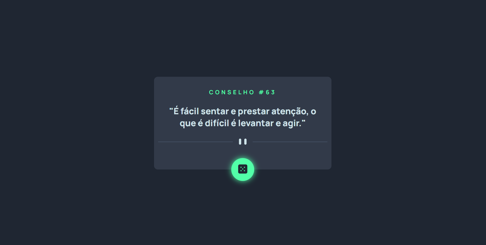

# Advice Generator

Esse é a solução da realização de um Gerador de conselhos proposto pelo curso DevQuest, em alternativa ao desafio [Frontend Mentor | Advice generator app coding challenge](https://www.frontendmentor.io/challenges/advice-generator-app-QdUG-13db)

## Desafio 

Construir um aplicativo que gere conselhos aleatórios, para ser aprimorado as habilidades de posicionamento de elementos usando flexbox e utilização de APIs.

Essa é a primeira etapa do exercício, logo foi realizado somente a construção do HTML e CSS.

## Screenshots

Versão para desktop

Versão para mobile

## Tecnologias utilizadas

- HTML
- CSS
- Flexbox