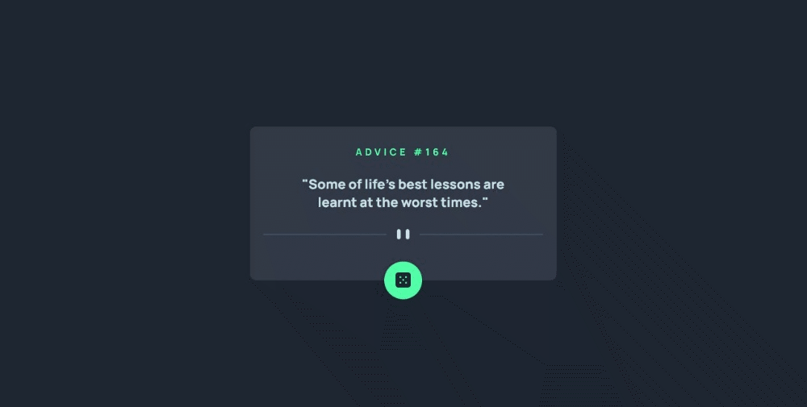

# Advice Generator

Esse é a solução da realização de um Gerador de conselhos proposto pelo curso DevQuest, em alternativa ao desafio [Frontend Mentor | Advice generator app coding challenge](https://www.frontendmentor.io/challenges/advice-generator-app-QdUG-13db)

## Desafio 

Construir um aplicativo que gere conselhos aleatórios, para ser aprimorado as habilidades de posicionamento de elementos usando flexbox e utilização de API.

Para gerar um novo conselho aleatório foi utilizado a API [Advice Slip](https://api.adviceslip.com/) e Javascript

## Screenshots

Versão para desktop

Versão para mobile

## Tecnologias utilizadas

- HTML
- CSS
- Flexbox
- Javascript
- API 